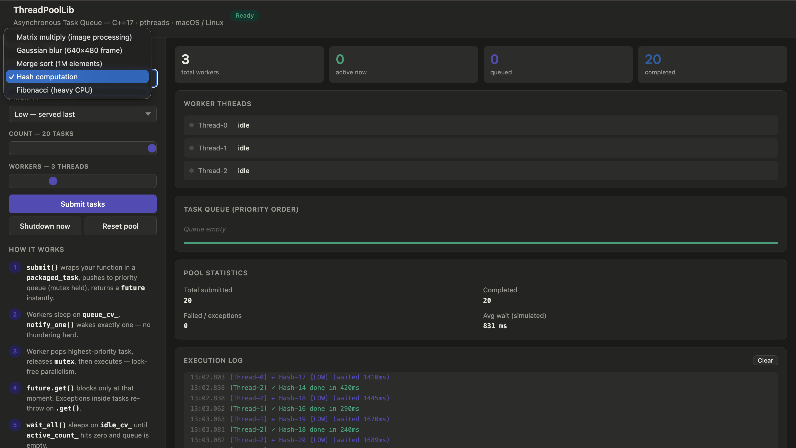

# Asynchronous Thread Pool Library (C++)

A lightweight and reusable C++17 thread pool library built from scratch for asynchronous task execution and efficient thread management. The project demonstrates core multithreading concepts such as task scheduling, synchronization, futures, condition variables, and the producer-consumer pattern.

## Features

- Fixed-size worker thread pool
- Thread-safe task queue
- Asynchronous task execution using `std::future`
- Priority-based task scheduling
- Graceful and immediate shutdown support
- Runtime statistics collection
- Unit and integration testing
- Interactive HTML visualization
- Modular and reusable design

## Project Structure

```text
ThreadPoolLib/
├── include/
│   ├── ThreadPool.h
│   ├── TaskQueue.h
│   └── WorkerThread.h
├── src/
│   └── ThreadPool.cpp
├── examples/
│   └── demo.cpp
├── tests/
│   └── test_threadpool.cpp
├── screenshots/
│   └── project_structure.png
├── threadpool_ui.html
├── Makefile
└── README.md
```

## Project Screenshot

The screenshot below shows the project structure and organization.



## Technologies Used

- C++17
- Standard Template Library (STL)
- Multithreading
- Mutexes and Condition Variables
- Futures and Packaged Tasks
- Atomic Operations
- Makefile
- HTML

## Build Instructions

### Run Demo Application

```bash
make demo
```

### Run Unit Tests

```bash
make tests
```

### Build Static Library

```bash
make lib
```

### Clean Build Files

```bash
make clean
```

## Example Usage

```cpp
#include "ThreadPool.h"

using namespace tpl;

int main() {
    ThreadPool pool(4);

    auto result = pool.submit([]() {
        return 10 + 20;
    });

    std::cout << "Result: " << result.get() << std::endl;

    return 0;
}
```

## How It Works

1. Tasks are submitted to a shared thread-safe queue.
2. Worker threads wait for available tasks.
3. When a task is added, an idle worker is notified.
4. The worker executes the task independently.
5. Results are returned through `std::future`.
6. Synchronization is handled using mutexes, condition variables, and atomic variables.

## Key Concepts Implemented

- Thread Pool Design Pattern
- Producer-Consumer Architecture
- Task Scheduling
- Priority Queues
- Thread Synchronization
- Condition Variables
- Futures and Asynchronous Programming
- Resource Management (RAII)
- Concurrent Programming in C++

## Learning Outcomes

This project provided hands-on experience in:

- Multithreaded programming using modern C++
- Designing reusable system-level libraries
- Thread synchronization and communication
- Concurrent data structures
- Asynchronous task execution
- Unit and integration testing
- Performance-oriented software design

## Future Improvements

- Dynamic thread pool resizing
- Task cancellation support
- Work-stealing scheduler
- Performance benchmarking tools
- Enhanced monitoring and logging

## Author

**Yoga Pradeep S**  
Computer Science and Engineering Student

GitHub: https://github.com/yoga-pradeep